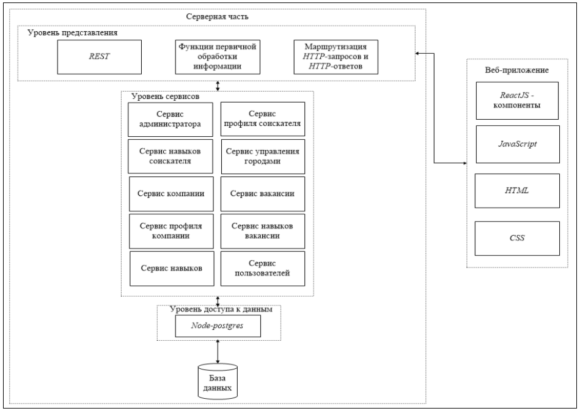

## Search_specialist

Web application for recruiting specialists. The app helps job seekers to quickly create resumes and view vacancies. Recruiters can create and modify vacancies, company accounts, and invite job seekers for interviews.

### Installation
1. `npm install` client, server.
2. Install Postgresql if not already installed and run. 
   - Open the terminal, and `cd` into `server`. 
   - `npm run recreate-db:local`.
   > Your actual database schema will go to `server/db/recreate-schema.sql` and you can add sample test data in `server/db/populate-db.sql`
3. Execute the command `npm start` for client and server.

### About
All technologies used for the back-end:` NodeJS; Express; PostgresSQL; REST API; Nodemailer; Passport; JWT; Nodemon`. All technologies used for the front-end: `ReactJS; React Router; Fetch API; Semantic UI React; Moment`.

Database diagram contain 8 tables.

Structure schema application

Use case diagram

Screenshots of the application interface in the ["img"](https://github.com/JustAnya/Search_specialist/tree/main/SEARCHSPECIALIST/img)
